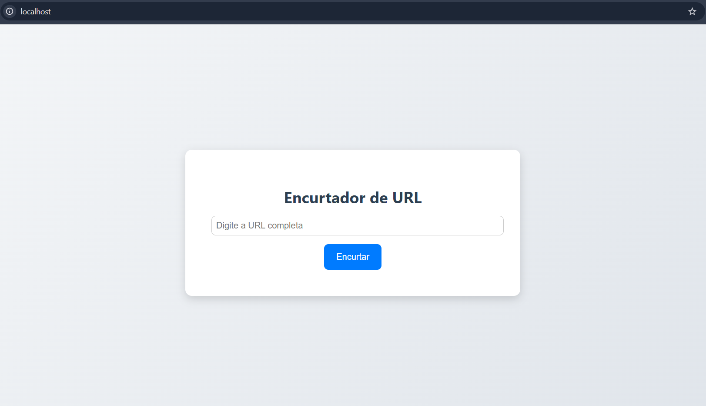

# Containerized URL Shortener

<p align="center">
    
</p>

This project is a **URL shortener** that uses Docker to run all parts of the application simultaneously in separate containers using Docker Compose.

## Technologies Used


## Prerequisites

- [Docker](https://docs.docker.com/get-docker/) installed 

## 1. Cloning
```bash
git clone https://github.com/seuusuario/seuprojeto.git
```
## 2. Running with Docker Compose
Navigate into the repository:
```bash
cd containerized_url_shortener
```
Build the images:
```bash
docker compose build
```
Start the containers:
```bash
docker compose up -d
```
## 3. Access
You can now access the created containers through the following addresses:

**URL Shortener Frontend**
> http://localhost:80/ 

**Backend Server**
> http://localhost:8000/docs or http://localhost:80/shorten

**MongoDB Database**
> mongodb://mongodb:27017/shortener

## Additional Documentation

[NGINX SERVER FRONTEND](./shortener_frontend_nginx/README.md)

[FASTAPI SERVER BACKEND](shortener_backend/README.md)
